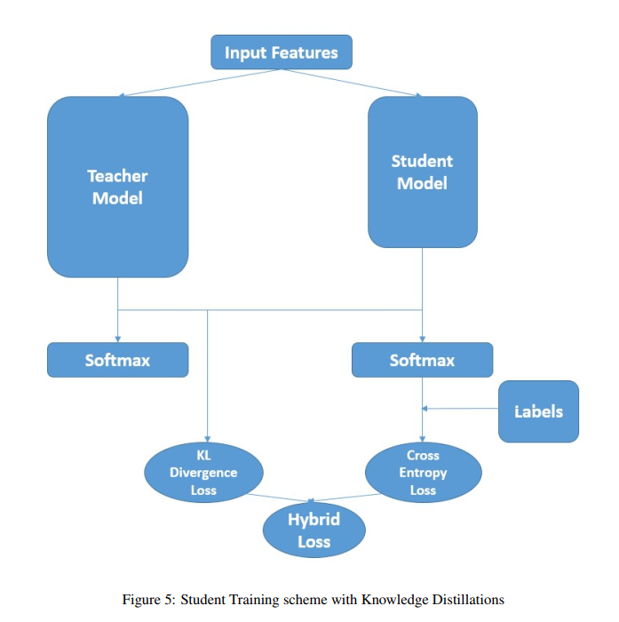
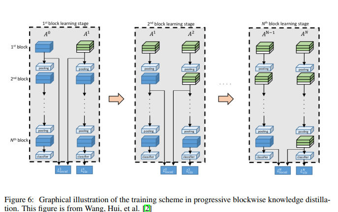

# Knowledge Distillation

In this project we explore the concept of knowledge distilation. We explored the main project objective of distilling knowledge from a well-trained teacher network into a simpler student network, by using soft targets from the former to train the latter. Furthermore, we extended our work by examining a more recent paper on knowledge distillation through model compression, by using the block-wise outputs from the teacher network to train the student network. Finally, as both methods are different knowledge distillation methods, we experimented and made comparisons between them.

**Basic Knowledge Distillation[1]** and **Progressive Blockwise Knowledge Distillation[2]**

  
  

## Refrences
[1] Geoffrey Hinton, Oriol Vinyals, and Jeff Dean. Distilling the knowledge in a neural network. arXiv preprint
arXiv:1503.02531, 2015.

[2] Hui Wang, Hanbin Zhao, Xi Li, and Xu Tan. Progressive blockwise knowledge distillation for neural
network acceleration. In IJCAI, pages 2769–2775, 2018.
